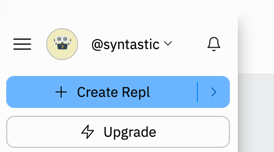
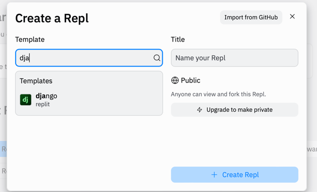
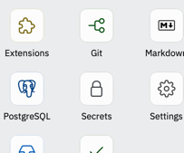
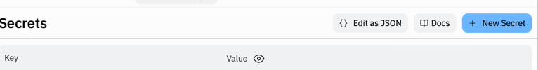
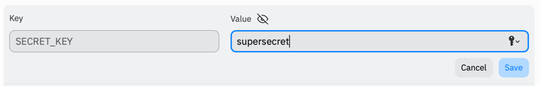
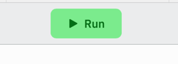

# What is Python
Python is dynamically typed and garbage-collected. It supports multiple programming 
paradigms, including structured (particularly procedural), object-oriented and functional 
programming. It is often described as a "batteries included" language due to its comprehensive 
standard library.

# Data types
Even though Python is dynamically typed and doesn't make you add the type to variables, it still
uses/has many types.  The three most important types we need to know right now are
1. Strings are values that are surrounded by single or double quotes and can be any 
   sequence of zero or more character, like
   ```python
      "I'm a string"
      'So am I!'
   ```
1. Integers are positive and negative number, without any quotes or decimals, like
   ```python
      1
      123
      -3242
   ```
1. Booleans are values used for evaluating expression and can only be either `True` or `False`.

# Variables
Varaibles are used to store and modify data.  Some basic variables usage looks like
```python
myString = "a string"
myInt = 123
myBoolean = True
```


# Creating the base project
1. To get our base project started, click the `Create Repl`
   
2. Search for and select Django, name your new Repl, and click the blue `Create Repl` button.
   
3. In the bottom left, click the `Secrets` button.
   
4. Click the blue `New Secret` button in the `Secrets` pane.
   
5. Add a secret with key: `SECRET_KEY` and value: `supersecret`, then click the blue `Save` button.
   
3. Press the green `Run` button at the top of the screen.
   

# Creating a poll app
1. Create the poll app
   ```shell
   python manage.py startapp polls
   ```
1. Update `polls/views.py` with
   ```python
   from django.http import HttpResponse

   def index(request):
     return HttpResponse("Hello, world. You're at the polls index.")
   ```
1. Create a new `polls/urls.py` file with
   ```python
   from django.urls import path
   
   from . import views
   
   urlpatterns = [
     path('', views.index, name='index'),
   ]
   ```
1. Update the `django_project/urls.py` to be
   ```python
   from django.contrib import admin
   from django.urls import include, path
   
   urlpatterns = [
     path('polls/', include('polls.urls')),
     path('admin/', admin.site.urls),
   ]
   ```
1. You may need to rerun the project at this point if you don't see the webview update.